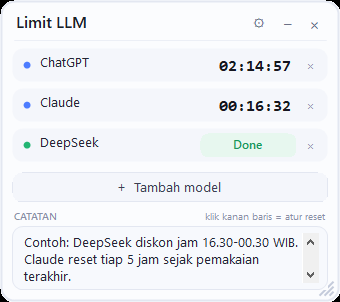

# Limit LLM — StickyCountdown

Widget desktop ringan untuk melacak **countdown reset limit pemakaian model AI** (ChatGPT, Claude, DeepSeek, Gemini, dll). Satu baris untuk satu model, lengkap dengan catatan bebas.



## Fitur

- **Multi model** — satu baris per model, nama bisa langsung diketik. Default 1 baris, tinggal tambah manual pakai **+ Tambah model** (maks 10)
- **Hapus baris** — tombol **×** di setiap baris (atau klik kanan → Hapus baris)
- **Dua cara atur reset** (klik kanan baris → pilih):
  - **Hitung mundur ... jam** — misal isi `5` (bisa desimal, `4.5`), otomatis countdown 5 jam
  - **Sampai jam ...** — misal `22:00`, countdown sampai jam 10 malam (kalau sudah lewat, ditanya mau ke besok atau langsung SIAP)
- **Auto popup saat countdown habis** — widget otomatis muncul lagi (walau sedang disembunyikan di tray atau diperkecil), baris berkedip, dan **tidak bisa disembunyikan/diperkecil sampai kamu klik Done**. Plus notifikasi Windows (toast) saat habis
- **Minimize ke system tray** — tombol **−** menyembunyikan widget dari layar dan tetap ada sebagai **icon di tray** (pojok kanan samping jam, bareng Windows Defender dll). Klik 2x icon tray untuk buka lagi. Klik 2x header untuk mode pill kecil
- **Auto start Windows** (di ⚙ Pengaturan) — widget otomatis jalan saat Windows nyala, langsung tersembunyi rapi di tray
- **Countdown akurat walau PC mati/restart** — target disimpan sebagai waktu absolut, jadi sisa waktu menyesuaikan sendiri; kalau limitnya habis saat PC mati, begitu nyala barisnya langsung SIAP
- **Ukuran fleksibel** — seret tepi/sudut widget (ada grip di kanan bawah), ukuran tersimpan otomatis
- **Bagian catatan** — tulis info bebas, misal jam pakai ideal atau harga model yang beda per jam (contoh: diskon DeepSeek di jam tertentu)
- **Pengaturan (⚙)** — di dalamnya ada:
  - **Bahasa** — Indonesia / English (langsung berubah tanpa restart)
  - **Timer shutdown** — jadwalkan PC mati otomatis (misal 90 menit), **tersembunyi dari tampilan utama**. Tetap berjalan walau widget ditutup (pakai layanan shutdown bawaan Windows) dan bisa dibatalkan kapan saja
- **Selalu di atas** bisa di-toggle (klik kanan area kosong)
- Posisi, ukuran, isi, dan pengaturan tersimpan otomatis di `settings.ini`
- **Tanpa install apa-apa** — pakai .NET Framework yang sudah ada di semua Windows 10/11

## Cara pakai

1. Unduh / clone repo ini
2. Double-click `StickyCountdown.exe`
3. Ketik nama model di barisnya
4. Klik angka countdown (atau klik kanan baris) → pilih **Hitung mundur ... jam** atau **Sampai jam ...**
5. Tambah baris dengan tombol **+ Tambah model**

Saat countdown habis: baris berubah hijau + tombol **Done** muncul. Setelah klik **Done**, baris kembali kosong dan widget bisa diperkecil lagi.

Kontrol lain:

- **−** (kanan atas) — sembunyikan ke tray; **□** — buka lagi
- **⚙** (kanan atas) — pengaturan: bahasa, auto start Windows, timer shutdown
- **Klik 2x icon tray** — buka widget lagi (klik kanan icon → menu)
- **Klik 2x di header** — mode pill kecil (hemat tempat)
- **×** (kanan atas) — keluar total
- **Drag header** — pindahkan widget
- **Seret tepi / sudut kanan bawah** — ubah ukuran widget
- **Klik kanan area kosong** — menu: tambah model, perkecil, selalu di atas, keluar

> Catatan: saat ada aplikasi lain dalam mode fullscreen, Windows otomatis menyembunyikan window "selalu di atas" (perilaku sistem, bukan bug).

## Build dari source

Butuh Windows + .NET Framework 4.x (bawaan sistem). TIDAK perlu install Visual Studio atau .NET SDK.

```powershell
# dari folder project
powershell -ExecutionPolicy Bypass -File build.ps1
```

Atau manual dengan compiler bawaan Windows:

```powershell
& "C:\Windows\Microsoft.NET\Framework64\v4.0.30319\csc.exe" /nologo /target:winexe /out:StickyCountdown.exe `
  /r:System.dll /r:System.Windows.Forms.dll /r:System.Drawing.dll /r:Microsoft.VisualBasic.dll `
  /win32icon:app.ico src\StickyCountdown.cs
```

## Struktur project

```
StickyCountdown.exe   widget siap pakai
src\                  source code (C# WinForms, single file)
build.ps1             script build
tools\make-icon.ps1   regenerasi app.ico
app.ico               ikon aplikasi
screenshot.png        screenshot untuk README
```

## Lisensi

[MIT](LICENSE) © 2026 fannndi
